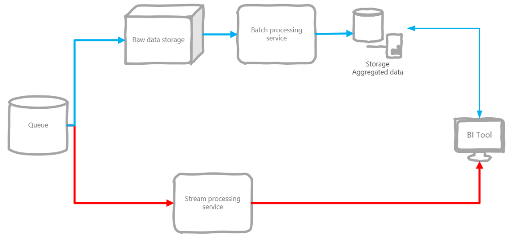
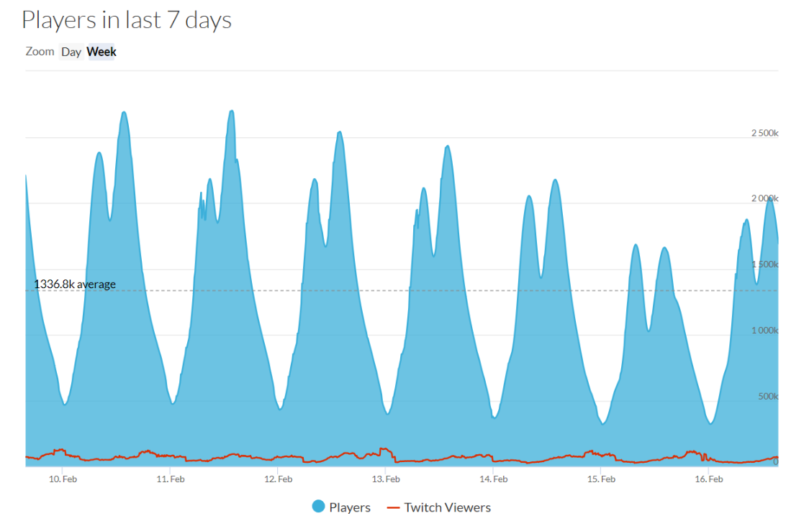
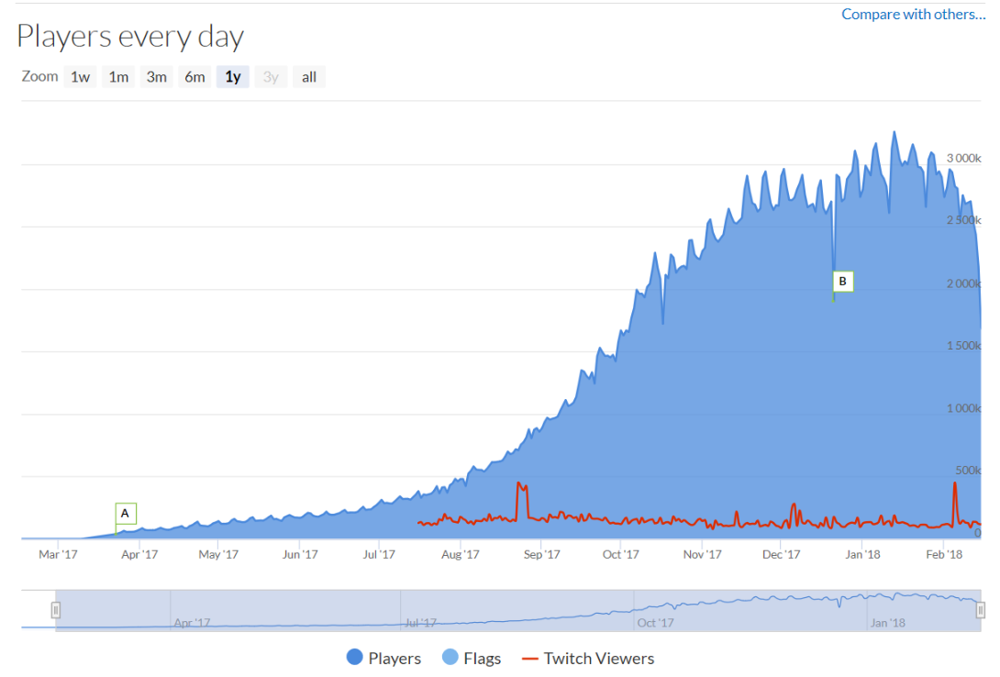
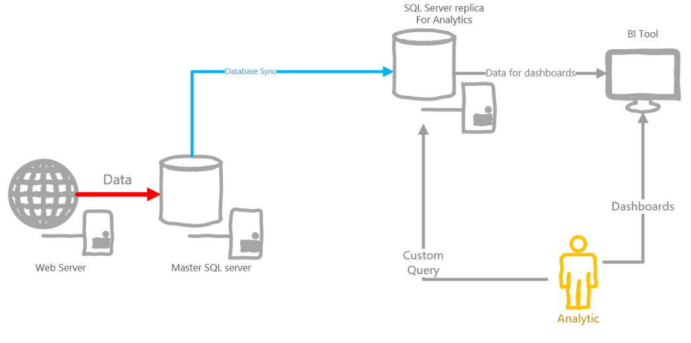
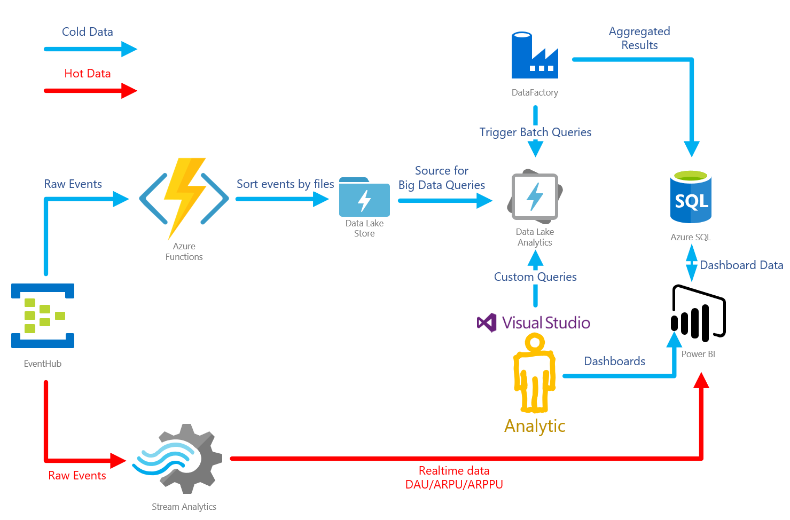

# Строим свою игровую аналитику в облаке: поиск подходящего варианта

## TODO

* [ ] Добавить пример мега-кастомного запроса

По долгу службы, я работаю со многими игровыми компаниями. Я заметил, что по мере роста проектов, в студиях появляется необходимость в продвинутых сценариях аналитики. После того, как несколько игровых компаний заинтересовались в данном подходе, я решил задокументировать его в этой статье.

На рынке много продуктов, подходящих для игровой аналитики: Mixpanel, Localytics, Flurry, devtodev, deltaDNA, GameAnalytics. Но все же многие игровые студии хотят свою систему. Ответы на вопросы "Почему?" и "Как это сделать?" и "Сколько это стоит?" под катом.

## Почему?

Универсальный комбайн хорош для выполнения простых задач. Но если нужно сделать что-то посложнее, его возможностей не хватает. Например, вышеупомянутые системы аналитики, в разной мере, обладают ограничениями в функционале:

* на количество параметров в событии
* на количество параметров в событиях воронки
* на частоту обновления данных
* на объем данных
* на период расчета данных
* на количество условий воронки
* и другие ограничения в таком же роде

Готовые решения не дают доступ к сырым данным. Например, если нужно провести более детальное исследование. Нельзя забывать и про машинное обучение и предиктивную аналитику. При значительном объеме аналитических данных, можно поиграться со сценариями машинного обучения: предсказание поведения пользователя, рекомендация покупок, персональные предложения и т.д.

> Игровые студии часто строят собственные решения **не на замену, а в дополнение** к уже имеющимся.

Итак, как выглядит своя система аналитики?

Распространенный подход при построении аналитики -- это [лямбда архитектура](https://en.wikipedia.org/wiki/Lambda_architecture), аналитика делится на "горячий" и "холодный" пути. По горчему пути идут данные, которые необходимо обработать с минимальной задержкой (количество игроков онлайн, платежи и т.д.).

По холодному пути идут данные, которые обрабатывают периодически (отчеты за день/месяц/год), а так же сырые данные для долгосрочного хранения.

Например, это полезно при запуске маркетинговых кампаний. Удобно видеть сколько юзеров пришло с кампаний, сколько из них совершили платеж. Это поможет отключить неэффективные каналы рекламы максимально быстро. Учитывая маркетинговые бюджеты игр -- это может сэкономить много денег.

К холодному пути относится все остальное: периодические срезы, кастомные отчеты и т.д.

Недостаточная гибкость универсальной системы, как раз, и толкает к разработке собственного решения. По мере того, как игра развивается, необходимость в детальном анализе поведения пользователей возрастает. Ни одна универсальная система аналитики не сравнится с возможностью строить SQL запросы по данным.

!! добавить пример мега-кастомного запроса !!

Поэтому студии разрабатывают свои решения. Причем, решение, часто, затачивается под конкретный проект.

Студии, разработавшие свою систему, были недовольны тем, что ее приходится постоянно поддерживать и оптимизировать. Ведь, если проектов много, или они очень большие, то количество собираемых данных растет очень быстро. Своя система начинает все больше тормозить и требовать значительных вкладов по оптимизации.

## Как?

### Технические риски

Разработка системы аналитики -- задача не из простых.
Ниже пример требований от студии, на которые я ориентировался.

* Хранение большого объема данных: > 3Tb
* Высокая нагрузка на сервис: > 10000 events / sec
* Поддержка языка запросов (предпочтительно SQL)
* Обеспечение приемлемой скорости обработки запросов: < 10 min
* Обеспечение отказоустойчивости инфраструктуры
* Обеспечение средств визуализации данных
* Аггрегирование регулярных отчетов

Это -- далеко не полный список.

Когда я прикидывал как сделать решение, я руководствовался следующими приоритетами/хотелками:

* быстро
* дешево
* надежно
* поддержка SQL
* возможность горизонтального масштабирования
* эффективная работа с минимум 3Tb данных, опять же масштабирование
* возможность обрабатывать данные real time

Так как активность в играх имеет периодический характер, то решение должно, в идеале, адаптироваться к пикам нагрузки. Например, во время фичеринга, нагрузка возрастает многократно.

Возьмем, например, Playerunknown's Battleground. Мы увидим четко-выраженные пики в течение дня.

Источник: [SteamDB](https://steamdb.info/app/578080/graphs/)

И если посмотреть на рост Daily Active Users (DAU) в течение года, то заметен довольно быстрый темп.

Источник: [SteamDB](https://steamdb.info/app/578080/graphs/)

Не смотря на то, что игра -- хит, похожие графики роста я видел и в обычных проектах. В течение месяца количество пользователей вырастало от 2 до 5 раз.

Нужно решение, которое легко масштабировать, но при этом не хочется платить за заранее зарезервированные мощности, а добавлять их, по мере роста нагрузки.

### Решение на базе SQL

Решение в лоб -- это взять какую-либо SQL БД, направлять туда все данные в сыром виде. Из коробки решает проблему языка запросов.

Напрямую данные с игровых клиентов нельзя направлять в хранилище, поэтому нужен отдельный сервис, который будет заниматься буферизацией событий от клиентов и пересылкой их в БД.

В данной схеме аналитики должны напрямую слать запросы в БД, что чревато. Если запрос тяжелый, БД может встать. Поэтому нужна реплика БД чисто для аналитиков.

Пример архитектуры ниже.

Такая архитектура обладает рядом недостатков:

* Про данные в реальном времени можно сразу забыть
* SQL -- мощное средство, но данные ивентов часто не ложатся на реляционную схему, поэтому приходится выдумывать костыли, типа p0-p100500 параметров у событий
* Учитывая объем аналитических данных, собираемых в день, размер БД будет расти как на дрожжах, нужно партиционировать и т.д.
* Аналитик может родить запрос, который будет выполнятся несколько часов, а может даже день, тем самым заблокировав других юзеров. Не давать же каждому свою реплику БД?
* Если SQL on-prem, то нужно будет постоянно заботиться об отказоустойчивости, достаточном объеме свободного места и так далее. Если в облаке -- может влететь в копеечку

### Решение на базе Hadoop

Тут стек довольно большой: Hadoop, Spark, Hive, Kafka, Storm, и т.д.

Источник: [dzone.com](https://dzone.com/articles/lambda-architecture-with-apache-spark)

Такая архитектура точно справится с любыми нагрузками и будет максимально гибкой. Это полноценное решение, которое позволит обрабатывать данные и в реальном времени, и строить зубодробительные запросы по холодным данным.

С ходу подобрать необходимый размер кластер, при отсутствии значительного опыта, нереально. Цена данного решения будет зависеть от количества виртуалок. Как правило, чтобы быть готовым к пиковым нагрузкам, вроде фичеринга, размер кластера берут с запасом. Это может влететь в копеечку.

Плюсы:

* Максимально гибкое решение
* Хорошая масштабируемость

Минусы:

* Поддержка и управление кластером Hadoop осуществляется вручную, масштабирование при пиковых нагрузках может вызвать проблемы
* Высокая стоимость, если кластер не утилизируется на 100%, или не уничтожается по ненадобности
* Сложно подобрать оптимальный размер кластера, если характер нагрузок, в основном, пиковый

### Решение на базе облачной платформы

Если использовать Hadoop экосистему на базе облачной платформы типа Azure HDInsight, то, как минимум, боль по поддержке и управлению кластером уйдет. Тем не менее, стоить это будет не дешево, так как биллинг происходит аналогично предыдущему решению, по количеству нод и времени их работы.

Более эффективный подход -- взять платформы, биллинг которых происходит по фактически используемым ресурсам.

* Для приема ивентов, Apache Kafka заменить Azure EventHub. Платить за пропускную способность.
* Для обработки данных заменить Apache Kafka/Hive/Spark/Storm на Azure Data Lake Analytics (ADLA) и Azure Stream Analytics
* Azure Data Lake Store (ADLS) -- HDFS хранилище для данных
* Power BI/Tableau/др. для визуализации

**Что это решает?**

* Нет кластера.
  * При простое платишь только за хранилище и пропускную способность EventHub
  * При выполнении запроса через ADLA платишь только за реальное время исполнения запроса и степень параллелизации
  * Не нужно управлять и поддерживать кластер
* Сохраняются все плюшки от Hadoop решения:
  * Возможность обрабатывать данные в реальном времени или батчами
  * Высокая масштабируемость
  * SQL-запросы (U-SQL)
  * Возможность писать кастомный код к U-SQL

### Конкретные цифры

Все это прекрасно, но давайте больше конкретики. Ниже -- пример расчета, который я делал для одной из студий.

Я использовал [Azure Pricing Calculator](https://azure.microsoft.com/en-us/pricing/calculator/) для расчета стоимости.

Рассчитывал цены для работы с холодными данными в регионе West Europe.

Для простоты, я считал только Compute мощности. Я не учитывал хранилище, так как его размер сильно зависит от контекста, да и, обычно, не сильно влияет на цену.

Так же я не учитывал системы буфферизации сообщений, вроде Apache Kafka и EventHub.

| Решение                   | Цена    |
|---------------------------|---------|
| Spark на Azure HDInsight  | $670.14 |
| Spark на голых VM         | $525.6  |
| Azure Data Lake Analytics | $60     |

Теперь подробнее по расчетам.

#### **Spark on Azure HDInsight**

Минимальный размер кластера:

2 x Head Nodes (A3 4 cores 7Gb RAM)
1 x Worker Nodes (A3 4 cores 7Gb RAM)

Всего: $670.14 / мес

#### **Spark on Bare VMs**

Та же самая конфигурация кластера, но развернутая на голых виртуалках $525.6 / мес. Я не считал размер managed дисков.

Дешевле, но прибавляется работа по управлению и поддержке кластера.

#### **Azure Data Lake Analytics**

Цена в Европе \$2 за [Analytics Unit](https://blogs.msdn.microsoft.com/azuredatalake/2016/10/12/understanding-adl-analytics-unit/) в час.
Analytics Unit -- по сути, одна нода. $2/час за ноду дороговато, но биллится это дело поминутно. Обычно Job занимает минимум минуту.

Если Job большой, то нужно больше AU чтобы его распараллелить.

Предположим регулярные отчеты для дашборда собираются раз в день. Пусть суммарно Job для отчетов выполняется 1 час.

`1 h * 1 AU * $2 * 30 дней = $60`

На самом деле час -- это с большим запасом. Поэтому в этот час можно заложить и кастомные запросы, которые будут выполнять аналитики время от времени.

Так же к данной цене следует добавить операции к Azure Data Lake Store, но там довольно смешная цена, так как биллинг осуществляется за каждые 10 000 операций.

### Итоги по решениям

Если аналитика молотит запросы 24/7/365, то имеет смысл держать свой кластер. Причем самым выгодным вариантом, по деньгам, будут голые виртуалки с Reserved Instances на год.

Если заморачиваться с поддержкой кластера не хочется, то тут можно выбрать HDInsight. Правда это выйдет примерно ~20% дороже.

Если же запросы выполняются периодически: регулярные срезы данных, кастомные запросы от аналитиков и т.д., - то самый выгодный вариант облачный сервис типа Azure Data Lake Analytics.

Hadoop стек не подойдет для маленьких проектов, или проектов на начальной стадии. А вот облачное решение одинаково хорошо как для маленьких проектов, так и для масштабных.

Нужно учитывать, что для полноценной лямбда-архитектуры необходим Message Broker и хранилище. Их в расчетах я не учитывал.

В любом случае, последний вариант мне показался самым простым и выгодным, поэтому я остановился именно на нем.

## Игровая аналитика на Azure Event Hub / Azure Data Lake Analytics / Azure Stream Analytics / Power BI

### Архитектура

Прикинув все за и против, я взялся за реализацию лямбда архитектуры на Azure. Она выглядит следующим образом:

**Azure Event Hub** -- это очередь, буфер, который способен принимать огромное количество сообщений. Так же есть приятная фича записи сырых данных в хранилище. В данном случае -- Azure Data Lake Storage (ADLS).

**Azure Data Lake Store** -- хранилище, базирующееся на HDFS. Используется в связке с сервисом Azure Data Lake Analytics.

**Azure Data Lake Analytics** -- сервис аналитики. Позволяет строить U-SQL запросы к данным, лежащим в разных источниках. Самый быстрый источник -- ADLS. В особо сложных случаях, можно писать кастомный код для запросов, на C#. Есть удобный тулсет в Visual Studio, с подробным профайлингом запросов.

**Azure Stream Analytics** -- сервис для обработки потока данных. В данном случае используется для аггрегации "горячих" данных и передачи их для визуализации в PowerBI

**Azure Data Factory** -- довольно спорный инструмент. Позволяет организовывать "пайплайны" данных. В данной конкретной архитектуре, используется для запуска "батчей". То есть запускает запросы в ADLA, вычисляя срезы за определенное время.

**PowerBI** -- инструмент бизнес аналитики. Используется для организации всех дашбордов по игре. Умеет отображать реалтайм данные.

### Разбор событий

#### **Холодные данные**

После поступления в EventHub, дальше события должны проходить по двум путям: холодному и горячему. Холодный путь ведет в хранилище ADLS. Тут возможно пойти несколькими путями.

##### **EventHub's Capture**

Самый простой -- использовать Capture фичу EventHub'a. Она позволяет автоматически сохранять сырые данные, поступающие в хаб, в одно из хранилищ: Azure Storage или ADLS. Фича позволяет настроить паттерн именования файлов, правда сильно ограниченный.

Хотя фича и полезная, подойдет она не во всех случаях. Например, мне она не подошла, так как время, используемое в паттерне для файлов, соответствует времени прибытия ивента в EventHub.

По факту, в играх, ивенты могут накапливаться клиентами, а затем посылаться пачкой. В таком случае, ивенты попадут в неправильный файл.

> Организация данных в файловой структуре очень важна для эффективности ADLA. Накладные расходы на открытие/закрытие файла довольно велики, поэтому ADLA будет наиболее эффективным при работе с большими файлами. Опытным путем, я выяснил оптимальный размер -- от 30 до 50 Мб. В зависимости от нагрузки, может понадобиться разбивать файлы по дням/часам.

Еще одна причина -- отсутствтие возможности разложить ивенты по папкам, в зависимости от типа самого ивента. Когда дело дойдет до аналитики, запросы должны будут быть максимально эффективными. Самый оптимальный способ отфильтровать ненужные данные -- не читать файлы совсем.

Если события будут смешаны внутри файла по типу (например, события авторизации и экономические события), то часть вычислительных мощностей аналитики будет тратиться на откидывание ненужных данных.

Плюсы:

* Быстро настроить
* Просто работает, без всяких заморочек
* Дешево

Минусы:

* Поддерживает только AVRO формат при сохранении событий в хранилище
* Обладает достаточно ограниченными возможностями по именованию файлов

##### **Stream Analytics (Холодные данные)**

Stream Analytics позволяет писать SQL-подобные запросы к потоку событий. Есть поддержка EventHub'a как источника данных и ADLS в качестве вывода. Благодаря этим запросам, в хранилище можно складывать уже трансформированные/агреггированные данные.

Аналогично, обладает скудными возможностями по именованию файлов.

Плюсы:

* Быстрая и простая настройка
* Поддерживает несколько форматов для ввода/вывода событий

Минусы:
 (Холодные данные)
* Обладает достаточно ограниченными возможностями по именованию файлов
* Цена
* Отсутствие динамического масштабирования

##### **Azure Functions (Холодные данные)**

Наиболее гибкое решение. В Azure Functions есть binding для EventHub, и не надо заморачиваться с разбором очереди. Так же Azure Functions автоматически скалируются.

Именно на этом решении я остановился, так как смог размещать события в папках, соответствующих времени генерации события, а не его прибытия. Так же сами события удалось раскидать по папкам, согласно типу события.

Для биллинга есть две опции:

* Consumption Plan -- трушный serverless, платите за используемую память в секунду. При больших нагрузках может быть дороговато
* App Service Plan -- в данном варианте у Azure Functions есть сервер, его тип можно выбирать, вплоть до бесплатного, есть возможность автомасштабирования. Именно это опция в моем случае оказалась дешевле.

Плюсы:

* Гибкость в именовании файлов с сырыми данными
* Динамическое масштабирование
* Есть встроенная интеграция с EventHub
* Низкая стоимость решения, при правильно выбранном биллинге

Минусы:

* Необходимо писать кастомный код

#### **Горячие данные**

##### **Stream Analytics (Горячие данные)**

Опять же Stream Analytics самое простое решение для аггрегации горячих данных. Плюсы и минусы примерно те же, что и для холодного пути. Основной причиной выбора Stream Analytics является автоматическая интеграция с PowerBI. Горячие данные можно отгружать в "реальном" времени.

Плюсы:

* Быстрая и простая настройка
* Имеет множество выводов, включая SQL, Blob Storage, PowerBI

Минусы:

* Поднможество T-SQL, используемое в Stream Analytics, все же имеет свои ограничения, при решении некоторых задач можно упереться в лимиты
* Цена
* Отсутствие динамического масштабирования

##### **Azure Functions (Горячие данные)**

Azure Functions, опять же, самое гибкое решение. В Azure Functions есть binding для EventHub, и не надо заморачиваться с разбором очереди. Так же Azure Functions автоматически скалируются.

Именно на этом решении я остановился, так как смог размещать события в папках, соответствующих времени генерации события, а не его прибытия. Так же сами события удалось раскидать по папкам, согласно типу события.

Для биллинга есть две опции:

* Consumption Plan -- трушный serverless, платите за используемую память в секунду. При больших нагрузках может быть дороговато
* App Service Plan -- в данном варианте у Azure Functions есть сервер, его тип можно выбирать, вплоть до бесплатного, есть возможность автомасштабирования. Именно это опция в моем случае оказалась дешевле.

Плюсы:

* Можно решить любую задачу
* Динамическое масштабирование
* Есть встроенная интеграция с EventHub
* Низкая стоимость решения, при правильно выбранном биллинге

Минусы:

* Необходимо писать кастомный код
* Так как функции stateless, необходимо отдельное хранилище состояния

## Итоги

Существующие решения, предлагаемые на рынке, довольно мощные. Но их все равно недостаточно для продвинутых заддач, они всегда имеют либо лимиты производительности, либо ограничения по кастомизации. И даже средние игры начинают довольно быстро в них упираться. Это побуждает на разработку собственного решения.

Встав перед выбором стека технологий, я прикинул цену. Мощняцкий Hadoop стек способен справиться с любыми нагрузками, но обходится очень дорого, если машины не загружены на 100% 24/7. Чтобы снизить стоимость, нужно думать как сделать динамическое масштабирование всего этого добра.

Вкладываться в разработку и поддержку инфраструктуры не хочется. Поэтому я рассмотрел облачные платформы. Игровая аналитика требует, в основном, периодических расчетов. Раз в день, например. Поэтому возможность платить только за то, что используешь -- как раз в точку.

В следующей статье я покажу как это все поднять в облаке.

## Мне стало интересно, хочу так же

Я -- часть команды Microsoft, которая помогает партнерам строить интересные и эффективные решения. Мы сейчас ищем еще несколько игровых компаний, с которыми можно сделать подобный проект по аналитике, или придумать новые интересные сценарии. Мы будем рассказать такие истории уже на примере живых и реальных игр.

Мы не только за слово, но и за дело, поэтому мы готовы, вместе с вашими разработчиками и аналитиками, сесть рука об руку, и разработать такой проект или пилот. Мы поможем подготовить статьи для интересных проектов и обсудить другие варианты плюшек с нашей стороны.

## Контакты

Больше технических деталей:
Мой канал про игровую разработку: https://t.me/poisonous_johns_lair
Telegram: https://t.me/poisonous_john
E-mail: [ivfateev@microsoft.com](mailto:ivfateev@microsoft.com)

Если вы хотите сделать такой же сценарий, или есть интересные идеи:
E-mail: [v-ivanko@microsoft.com](mailto:v-ivanko@microsoft.com)
Telegram: https://t.me/ivan_kopytov
