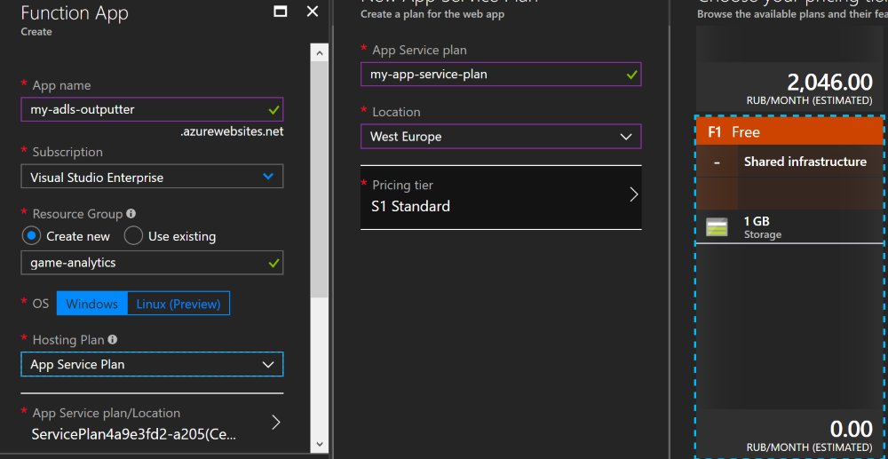

TODO:
* [ ] Описать создание EventHub

# Строим свою игровую аналитику в облаке: отправляем и сохраняем данные

В предыдущей части я рассказал почему необходима своя игровая аналитика, как ее построить и сколько это будет стоить. В этой статье я подробно опишу детали технического решения: как посылать данные в Azure EventHub, как их сохранять в Azure Data Lake Store и как правильно их разложить в хранилище для оптимизации запросов.

## Создание EventHub

## Посылка событий

Начнем с EventHub -- штука довольно простая. Имеет определенную пропускную способность. За нее и платишь. 1 Troughput Unit (TU) позволяет обрабатывать:

- на вход **до 1 MB/сек или 1000 ивентов/сек (что наступит быстрее)**.
- на выход до 2MB/сек

При превышении лимита на входящие данные, сервис отфутболивает реквест и кидает ServiceBusyException. Превышение лимитов на исходящие данные эксепшена не кидает, но скорость ограничивается. Максимальный размер события -- 64Кб.
Поэтому есть выбор, либо слать более жирные ивенты, но реже, либо мелкие, но чаще. Как правило, первый вариант предпочтительнее. Но я начал со второго, так как он проще.

Сервис может принимать сообщения по двум протоколам:

- AMQP
- HTTP

AMQP наиболее эффективный способ, но количество бесплатных коннектов по данному протоколу сильно ограничено. Поэтому AMQP подойдет, если посылать в EventHub серверную аналитику. Клиентскую аналитику я решил посылать напрямую в EventHub, поэтому HTTP. Писать тестовый клиент я решил на .Net Core. К сожалению, на момент написания статьи, официальный EventHub SDK не поддерживал HTTP протокол.

Поэтому я быстро накидал простенький HTTP клиент, для начала. Endpoint для отправки формируется следующим образом:

`_restAPIUrl = $"https://{eventHubNamespace}.servicebus.windows.net/{entityPath}";`

Где eventHubNamespace -- доменное имя Event Hub'a, которое вы указали при создании. А entityPath -- имя конкретного EventHub'a, куда будут слаться события.

Немного пришлось повозиться с генерацией SAS токена, необходимого для отправки ивента.

```csharp
    private string CreateToken(string url)
    {
        TimeSpan sinceEpoch = DateTime.UtcNow - new DateTime(1970, 1, 1);
        var week = 60 * 60 * 24 * 7;
        var expiry = Convert.ToString((int)sinceEpoch.TotalSeconds + week);
        string stringToSign = HttpUtility.UrlEncode(url) + "\n" + expiry;
        HMACSHA256 hmac = new HMACSHA256(Encoding.UTF8.GetBytes(_key));
        var signature = Convert.ToBase64String(hmac.ComputeHash(Encoding.UTF8.GetBytes(stringToSign)));
        var sasToken = String.Format(CultureInfo.InvariantCulture, "SharedAccessSignature sr={0}&sig={1}&se={2}&skn={3}", HttpUtility.UrlEncode(url), HttpUtility.UrlEncode(signature), expiry, _keyName);
        return sasToken;
    }
```

Данный код не следует размещать на клиенте, так как генерация токена требует приватного ключа. В идеале, клиент должен использовать токен, сгенерированный безопасным образом на сервере.

Отправка запроса -- попроще. Все что нужно -- добавить токен в заголовок Authorization.

```csharp
    var msg = new HttpRequestMessage(HttpMethod.Post, _restApiUrl);
    msg.Content = new StringContent(@event);
    msg.Headers.Add("Authorization", _token);

    var resp = await _httpClient.SendAsync(msg);
```

После тестового запуска клиента, можно зайти в портал и посмотреть, есть ли всплеск на графике входящих событий.

!! Вставить картинку со всплеском графика !!

## Создаем приложение Azure Functions

Создадим сначала само приложение Azure Functions.
Для этого, в портале тыкаем Create Resource, в поиск вводим "Function app".
Не особо оевидно, так как я сначала искал "Azure Functions" и искренне удивлялся отсутствию подходящих результатов.



Важный аспект -- создать новый App Service Plan и выбрать Pricing tier. Начать можно с бесплатного, а потом, после тестов, переключиться на что-нибудь побыстрее.

Дальше переходим к самому приложению. Чтобы извлечь максимальную производительность из Azure Functions, нужно использовать скомпилированное C# приложение. Для этого проще всего воспользоваться шаблоном приложения Azure Functions в Visual Studio. Этот шаблон будет доступен после [установки поддержки Azure Functions для VS](https://docs.microsoft.com/ru-ru/azure/azure-functions/functions-develop-vs).

Создаем новый проект Azure Functions в Visual Studio. Выбираем шаблон Queue Trigger. Path -- это имя конкретного EventHub'a, созданного ранее. Connection можно пока пропустить.

После этого откроется шаблон примерно такого вида:

```csharp
using System;
using Microsoft.Azure.WebJobs;
using Microsoft.Azure.WebJobs.Host;

namespace FunctionApp
{
    public static class Function1
    {
        [FunctionName("Function1")]
        public static void Run([QueueTrigger("myqueue-items", Connection = "")]string myQueueItem, TraceWriter log)
        {
            log.Info($"C# Queue trigger function processed: {myQueueItem}");
        }
    }
}
```

Интеграция с EventHub'ом настраивается посредством аттрибута QueueTrigger. Чтобы все заработало, необходимо заполнить Connection. Там нужно указать имя настройки приложения функций (App Setting), в котором будет Connection String к Event Hub.

При локальной разработке App Settings задаются в файле local.settings.json. Саму Connection String можно взять в настройках Event Hub'a в портале, в разделе Shared access policies. По умолчанию там только одна политика **RootManageSharedAccessKey**.

Для нашей функции нужен доступ только на чтение, поэтому я создам новую политику ADLSOutputterKey, и дам права только Listen права. Данную политику можно создать как в корне EventHub'a, так и для конкретной сущности (пути), тогда его область видимости будет еще более ограничена.

Теперь, кликнув по новому ключу, можно скопировать Connection String. Открываем local.settings.json и добавляем строку в настройки.

```json
{
  "IsEncrypted": false,
  "Values": {
    "EventHub": "<your-eventhub-connection-string>",
    "AzureWebJobsStorage": "",
    "AzureWebJobsDashboard": "",
  },
}
```

Чтобы можно было дебажить Azure Functions локально, нужно еще несколько настроек. Они есть внутри приложения Azure Functions, созданном в портале.

Открываем Azure Functions в портале, и тыкаем по Application Settings, там находим AzureWebJobsStorage, AzureWebJobsDashboard, копируем их значения и переносим в local.settings.json.

После этого пробуем собрать и запустить приложение в Visual Studio. Вы должны увидеть открывшуюся консоль, с запущенным Azure Functions хостом, оповещающем о том что он готов к работе.

Посылаем несколько сообщений в EventHub. Если настройка выполнена правильно, то в логе появятся сообщения об обработанных сообщениях.

## Создаем Service Principal

Перед тем, как приступить к написанию кода, необходимо создать так называемый **service principal**. Это своего рода реквизиты для работы приложений с API облака. В данном случае, service principal нужен для работы с API Azure Data Lake Store.

Для данной операции понадобится установить [Azure CLI](https://docs.microsoft.com/en-us/cli/azure/install-azure-cli?view=azure-cli-latest). По сути все действия, доступные в портале, можно сделать и из командной строки.

Итак, создаем service principal

` az ad sp create-for-rbac -n "ADLSOutputterPrincipal" --scopes /subscriptions/{subscriptionID}/resourceGroups/{resourceGroup}`

Узнать id своей подписки можно командой `az account list -o table`.
Имя ресурс группы нужно указать то, где расположен Azure Data Lake Store.
Указывать --scopes необходимо для того, чтобы приложение, использующее service principal имело минимальный доступ, только к указанной ресурс группе.

После создания service principal вы увидите выхлоп вроде такого:
```json
{
    "appId": "***",
    "displayName": "ADLSOutputterPrincipal",
    "name": "http://ADLSOutputterPrincipal",
    "password": "***",
    "tenant": "***"
}
```

Для приложения нужны appId, tenant и password.

## Авторизуемся в Azure Data Lake Store

На этом шаге предполагатеся, что Azure Data Lake Store уже создан. Я не описывал это отдельно, там все просто.

Чтобы использовать Azure Data Lake Store .Net SDK, в Azure Functions нужно указать несколько настроек.

Их нужно добавить как в local.settings.json, так и в Application Settings -> ConnectionStrings в портале.

```json
{
  "ConnectionStrings": {
    "ADLS_APPID": {
      "ConnectionString": "***",
      "ProviderName"    : "Custom"
    },
    "ADLS_SECRET": {
      "ConnectionString": "***",
      "ProviderName"    : "Custom"
    },
    "ADLS_TENANT": {
      "ConnectionString": "***",
      "ProviderName"    : "Custom"
    },
    "ADLS_ACCOUNT": {
      "ConnectionString": "***.azuredatalakestore.net",
      "ProviderName"    : "Custom"
    }
}
```

ADLS_ACCOUNT -- это полное доменное имя ADLS хранилища.

Для того, чтобы скрыть детали авторизации, я вынес это в отдельный класс AdlsUtils.

Код основан на [официальной доке](https://docs.microsoft.com/en-us/azure/data-lake-store/data-lake-store-data-operations-net-sdk), и слегка изменен с учетом специфики Azure Functions.

Код требует следующих зависимостей:
- Microsoft.Azure.DataLake.Store
- Microsoft.Rest.ClientRuntime.Azure.Authentication

Добавим их через NuGet.

Лучшие практики Azure Functions рекомендуют переиспользовать клиенты к различным сервисам, делая их статическими. Поэтому пришлось использовать GetAwaiter().GetResult().


```csharp
    class AdlsUtils
    {
        private static readonly Uri ADL_TOKEN_AUDIENCE = new Uri(@"https://datalake.azure.net/");
        private static Task<ServiceClientCredentials> GetCreds(
           string tenant,
           Uri tokenAudience,
           string clientId,
           string secretKey)
        {
            SynchronizationContext.SetSynchronizationContext(new SynchronizationContext());

            var serviceSettings = ActiveDirectoryServiceSettings.Azure;
            serviceSettings.TokenAudience = tokenAudience;

            return ApplicationTokenProvider.LoginSilentAsync(
             tenant,
             clientId,
             secretKey,
             serviceSettings);
        }

        public static AdlsClient client { get { return _adlsClient.Value; } }

        private static Lazy<AdlsClient> _adlsClient = new Lazy<AdlsClient>(
            () =>
            {
                var adlsAcc = ConfigurationManager.ConnectionStrings["ADLS_ACCOUNT"].ToString();
                var tenant = ConfigurationManager.ConnectionStrings["ADLS_TENANT"].ToString();
                var clientId = ConfigurationManager.ConnectionStrings["ADLS_APPID"].ToString();
                var secret = ConfigurationManager.ConnectionStrings["ADLS_SECRET"].ToString();
                var adlCreds = GetCreds(tenant, ADL_TOKEN_AUDIENCE, clientId, secret)
                                    .GetAwaiter().GetResult();

                return AdlsClient.CreateClient(adlsAcc, adlCreds);
            }

        );
    }
}
```

## Записываем данные в хранилище

Наконец, самое интересное, ради чего весь сыр-бор.

```csharp
using System;
using System.Threading;
using System.Configuration;
using Microsoft.Azure.WebJobs;
using Microsoft.Azure.WebJobs.Host;
using Microsoft.Azure.WebJobs.ServiceBus;
using Microsoft.Rest;
using Microsoft.Rest.Azure.Authentication;
using Microsoft.Azure.DataLake.Store;
using Newtonsoft.Json;
using System.IO;
using Microsoft.IdentityModel.Clients.ActiveDirectory;

namespace AzureFunctions
{
    public static class RegisterEvent
    {
        [FunctionName("RegisterEvent")]
        public static void Run([EventHubTrigger("default", Connection = "EventHub")]string myEventHubMessage, TraceWriter log)
        {
            var json = JsonConvert.DeserializeObject<dynamic>(myEventHubMessage);
            string eventType = json.type;
            DateTimeOffset eventTime = DateTimeOffset.FromUnixTimeSeconds(long.Parse(json.event_time.ToString()));
            var filePath = $"/{eventType}/{eventTime.Year}/{eventTime.Month.ToString().PadLeft(2, '0')}/{eventTime.Day.ToString().PadLeft(2, '0')}.json";

            var bytes = System.Text.Encoding.UTF8.GetBytes(myEventHubMessage + "\n");
            AdlsUtils.client.ConcurrentAppend(filePath, true, bytes, 0, bytes.Length);
        }
    }
}
```

Пройдемся немного по коду.

Задача -- разложить события по двум критериям:

- время генерации события
- тип события

Сначала десериализуем событие. Предполагается, что события в формате JSON. Для десериализации используем Newtonsoft.Json, включенный в состав Azure Functions SDK.

Так же предполагается, что каждое событие содержит поле event_time, время генерации события в формате unix timestamp.

Далее преобразуем его в DateTimeOffset, так как понадобятся отдельные компоненты даты.

Далее формируется путь для записи событий.

`var filePath = $"/{eventType}/{eventTime.Year}/{eventTime.Month.ToString().PadLeft(2, '0')}/{eventTime.Day.ToString().PadLeft(2, '0')}.json";`

Верхний уровень иерархии -- тип события. Это необходимо, чтобы на этапе построения аналитических запросов, производить вычисления только по определенным типам событий.

Например, если мы считаем доходы, то захотим вычислять только события с типом purchase. Тогда аналитика может взять всего одну ветку иерархии файлов, сразу отсеивая ненужное.

Обратите внимание на .PadLeft() функцию. DateTimeOffset.Year и другие поля имеют целочисленный тип, поэтому при преобразовании в строку, leading zero будет отсутствовать. А это может доставить определенные неудобства в дальнейшем.

Далее пользуем ConcurrentAppend, чтобы добавить в файл строку с событием. Финальный файл будет не совсем валидным json, так как там будет один объект json на строку. Однако это позволит избежать кучи проблем по поддержке валидности json'a.

Запускаем приложение в Visual Studio. Посылаем несколько событий в EventHub. Если все сделано правильно -- в ADLS появится файл с событиями. Если что-то пошло не так -- дебажим. Visual Studio позволяет дебажить как локально запущенный инстанс, так и приложение Azure Functions, запущенное в облаке.

## Деплой приложения


## Оптимизируем количество запросов

