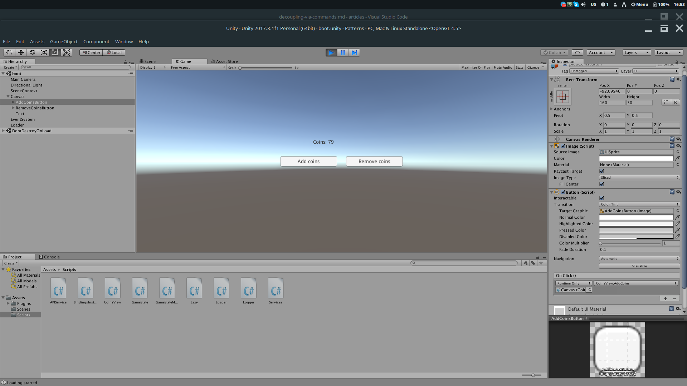

# Развязываем игровой код c помощью паттерна "Command"

В [предыдущей статье](http://goo.gl/NP9Yfy) я поднимал вопрос развязывания кода. И рассмотрел несколько вариантов: интерфейсы, Dependency Injection.

В этой статье я хочу разобрать еще один паттерн: [Команда (Command)](https://ru.wikipedia.org/wiki/%D0%9A%D0%BE%D0%BC%D0%B0%D0%BD%D0%B4%D0%B0_(%D1%88%D0%B0%D0%B1%D0%BB%D0%BE%D0%BD_%D0%BF%D1%80%D0%BE%D0%B5%D0%BA%D1%82%D0%B8%D1%80%D0%BE%D0%B2%D0%B0%D0%BD%D0%B8%D1%8F)). Он поможет избежать лишних зависимостей и упростить сложные алгоритмы. Это один из моих самых любимых паттернов.

## Паттерн Command

Что мы понимаем под словом "Команда"? Это что-то вроде приказа. С помощью команды человек выражает необходимость в совершении какого-либо действия. Действие -- неотделимо от команды.

Паттерн Command -- это способ представить действие в мире объектно-ориентированного программирования. И именно благодаря полиморфизму это становится возможным.

Идея паттерна в том, что все команды для системы одинаковы. В понятиях ООП все команды имеют общий интерфейс. Система может прозрачно исполнять любую из них. А это значит, что команда должна быть абсолютно самостоятельной, и инкапсулировать в себе все необходимые для ее исполнения данные.

Пока описание довольно абстрактно. Давайте перейдем к конкретике. Базовый интерфейс для всех команд:

```csharp
public interface ICommand
{
    void Execute();
}
```

Теперь пример конкретной реализации команды:

```csharp
public class WriteToConsoleCommand : ICommand
{
    public string Message { get; private set; }
    public void Execute() {
        Console.WriteLine(Message);
    }
}
```

А как же их исполнять? Напишем простую систему обработки команд.

```csharp
public interface IGameSystem
{
    void Execute(ICommand cmd);
}

public class LoggableGameSystem : IGameSystem
{
    public LoggableGameSystem(ILogger log)
    {
        _log = log;
    }

    public void Execute(ICommand cmd) {
        _log.Debug(string.Format("Executing command <{0}>: {1}", cmd.GetType(), cmd);
        cmd.Execute();
    }

    private ILogger _log;
}
```

Теперь мы можем логгировать каждую исполняемую команду для отладки. Удобно же? Но команду нужно подготовить к дебажному выводу, добавим метод ToString().

```csharp
public class WriteToConsoleCommand : ICommand
{
    public string Message { get; private set; }
    public void Execute() {
        Console.WriteLine(Message);
    }

    public override string ToString()
    {
        return Message;
    }
}
```

Проверим как оно работает.

```csharp
    class Program
    {
        static void Main(string[] args)
        {
            var gameSystem = new LoggableGameSystem();
            var cmd = new WriteToConsoleCommand("Hello world");
            var cmd2 = new WriteToConsoleCommand("Hello world2");
            gameSystem.Execute(cmd);
            gameSystem.Execute(cmd2);
        }
    }
```

Это довольно простой пример. Конечно, дебажный вывод полезен, но не понятно что еще полезного можно извлечь из этого паттерна.

В своих проектах я постоянно использую этот паттерн по нескольким причинам:

* В команде сохраняется все, что необходимо до ее исполнения. Она, по сути, иммутабельный объект. Поэтому ее легко передавать по сети, и одинаково исполнять как на клиенте, так и на сервере. Конечно, это при условии, что при одинаковых входных параметрах и клиент, и сервер, дают одни и те же результаты.
* Команда представляет собой очень маленький кусочек логики. Ее легко писать, легко понимать, и легко отлаживать. Так как команда иммутабельна, и не содержит никаких дополнительных зависимостей, для нее легко писать unit-тесты.
* Сложную бизнес логику легко выражать посредством набора простейших команд. Команды легко переиспользовать.
* Команда выступает может выступать чекпойнтом, ну или транзакцией, как вам больше нравится. Если изменение состояния данных происходит только посредством команд, это упрощает отладку, да и понимание программы. Если что-то сломалось, вы всегда можете проследить какая команда привела к ошибке. Что удобно -- можно видеть и параметры, с которыми была выполнена команда.
* Выполнение команд может быть отложенным. Типичный пример -- отправка команды на сервер. Когда пользователь инициировал какое-либо действие в игре, создается команда, и добавляется в очередь на исполнение. Фактическое же исполнение команды происходит только после подтверждения от сервера.
* Так как команды достаточно абстрагированы от всех зависимостей, легко менять архитектуру. Например, если раньше код был только оффлайнов и управление AI происходило только локально, то его легко поменять на управление AI с помощью сервера. Ведь коду без разницы кто отправляет команды, локальный код, или сервер.
* Код, написанный с идеологией команд, немного отличается от традиционного подхода с вызовом функций. Когда программист создает команду, он сообщает о необходимости изменить состояние. Как и когда это будет сделано -- его не интересует. Это позволяет творить интересные вещи.

Немного подробнее про последний пункт. Например, у вас была синхронная функция, которая должна стать асинхронной. Чтобы ее сделать это, вам необходимо изменить ее сигнатуру, и написать механизм обработки асинхронного результата в виде коллбека, или корутины, или async/await (если вы переползли на .net 4.6). И так каждый раз, для каждой отдельно взятой функции.

Механизм команд позволяет абстрагироваться от механизма исполнения. Поэтому если команда раньше исполнялась моментально, ее легко можно сделать асинхронной. Это даже можно менять динамичеки, в рантайме.

Конкретный пример. Игра поддерживает частичный оффлайн. Если сейчас сетевое соединение недоступно, то команды попадают в очередь, и исполняются в момент восстановления соединения. Если соединение есть, то команды исполняются моментально.

## Делаем модификацию стейта однонаправленной

### Теория

Что за однонаправленная модификация стейта? Идея позаимствованна из подхода [Flux](https://github.com/facebook/flux/tree/master/), описанного ребятами из Facebook. На этом же подходе строятся всякие новомодные библиотеки типа [Redux](https://redux.js.org).

В традиционных MV* подходах, View взаимодействуют с моделью в двустороннем порядке.

В Unity ситуация зачастую еще хуже. Традиционный MVC тут не подходит, и данные часто модифицируют прямо из View, как я это покажу ниже. В сложных приложениях количество связей зашкаливает, апдейт теряется в апдейте, все запутывается, и получается спагетти.


(Источник: [medium.com](https://medium.com/e-fever/revised-qml-application-architecture-guide-with-flux-a1de143fe13e))

Я предлагаю систему, похожую на Redux. Основная идея, что Redux предлагает хранить все состояние приложения в одном объекте. То есть одной модели.

Некоторые тут ужаснутся. Но ведь сериализация игрового состояния, чаще всего, и сводится в сериализации одного объекта. Это довольно естественный подход для игр.

Вторая идея в том, что состояние модифицируется с помощью Action'ов. По сути -- это ровно то же, что и Command, описанный ранее. View не может модифцировать состояние напрямую, а только посредством команды.

Третья идея -- естественное продолжение, View может только читать состояние и подписываться на его обновления.

Вот как это выглядит в идеологии Flux:


(Источник: [medium.com](https://medium.com/e-fever/revised-qml-application-architecture-guide-with-flux-a1de143fe13e))

В нашем случае Store -- это игровое состояние. А Action -- команда. Dispatcher, соответственно, то, что исполняет команды.

Такой подход даст много плюшек. Так как объект состояния всего один, а его модификация производится только через команды, то легко сделать единственное событие об обновлении состояния.

Тогда UI лего сделать реактивным. То есть автоматически обновлять данные при обновлении стейта (привет [UniRx](https://github.com/neuecc/UniRx), его применение рассмотрим в другой статье).

С таким подходом изменение состояния игры может быть инициировано и с серверной стороны. Так же, через команды. Так как событие об обновлении состояние ровно то же, то UI абсолютно фиолетово, откуда пришел апдейт.

Еще одна плюшка -- крутые возможности по отладке. Так как View может только рожать команды, то трекать изменения стейта становится проще паренной репы.

Детальное логирование, история команд, воспроизведение багов, и т.д., все это становится возможным благодаря такому паттерну.

### Реализация

Для начала опредилимся с состоянием игры. Пусть это будет следующий класс:

```csharp
    [System.Serializable]
    public class GameState
    {
        public int coins;
    }
```

Добавим сохранение состояния игры в файл формата JSON. Для этого сделаем отдельный менеджер.

```csharp
public interface IGameStateManager
{
    GameState GameState { get; set; }
    void Load();
    void Save();
}

public class LocalGameStateManager : IGameStateManager
{
    public GameState GameState { get; set; }

    public void Load()
    {
        if (!File.Exists(GAME_STATE_PATH))
        {
            return;
        }
        GameState = JsonUtility.FromJson<GameState>(File.ReadAllText(GAME_STATE_PATH));
    }

    public void Save()
    {
        File.WriteAllText(GAME_STATE_PATH, JsonUtility.ToJson(GameState));
    }

    private static readonly string GAME_STATE_PATH = Path.Combine(Application.persistentDataPath, "gameState.json"); }
```

В [предыдущей статье](https://medium.com/p/%D0%B0%D0%BD%D1%82%D0%B8%D0%BF%D0%B0%D1%82%D1%82%D0%B5%D1%80%D0%BD%D1%8B-%D0%B2-%D0%B8%D0%B3%D1%80%D0%BE%D0%B2%D0%BE%D0%B9-%D1%80%D0%B0%D0%B7%D1%80%D0%B0%D0%B1%D0%BE%D1%82%D0%BA%D0%B5-%D0%B7%D0%B0%D0%B2%D0%B8%D1%81%D0%B8%D0%BC%D0%BE%D1%81%D1%82%D0%B8-%D0%B2-%D0%BA%D0%BE%D0%B4%D0%B5-1bd879ef46ad) я рассматривал проблему зависимостей, и говорил о паттерне Dependency Injection (DI).

Настало время его использовать. Для Unity3d есть простой и удобный DI фреймворк [Zenject](https://github.com/modesttree/Zenject). Его и буду использовать. Установка и настройка довольно трививальны, и описаны подробно в документации. Поэтому сразу к делу. Объявим байндинг для IGameStateManager.

Я создал свой экземпляр `MonoInstaller` под названием `BindingsInstaller` согласно документации и добавил его на сцену.

```csharp
public class BindingsInstaller : MonoInstaller<BindingsInstaller>
{
    public override void InstallBindings()
    {
        Container.Bind<IGameStateManager>().To<LocalGameStateManager>().AsSingle();
        Container.Bind<Loader>().FromNewComponentOnNewGameObject().NonLazy();
    }
```

Так же я добавил байндинг для компонента Loader, который будет следить за загрузкой и выходом из игры.

```csharp
public class Loader : MonoBehaviour {

    [Inject]
    public void Init(IGameStateManager gameStateManager)
    {
        _gameStateManager = gameStateManager;
    }

    private void Awake()
    {
        Debug.Log("Loading started");
        _gameStateManager.Load();
    }

    private void OnApplicationQuit()
    {
        Debug.Log("Quitting application");
        _gameStateManager.Save();
    }

    private IGameStateManager _gameStateManager;
}
```

Скрипт Loader запускается самым первым в игре. Его я использую как отправную точку. А так же как скрипт, который следит за загрузкой и сохранением игрового состояния.

Теперь я накидаю простейший View для UI.

```csharp
public class CoinsView : MonoBehaviour
{
    public Text currencyText;

    [Inject]
    public void Init(IGameStateManager gameStateManager)
    {
        _gameStateManager = gameStateManager;
        UpdateView();
    }

    public void AddCoins()
    {
        _gameStateManager.GameState.coins += Random.Range(1,100);
        UpdateView();
    }

    public void RemoveCoins()
    {
        _gameStateManager.GameState.coins -= Random.Range(1,100);
        UpdateView();
    }

    public void UpdateView()
    {
        currencyText.text = "Coins: " + _gameStateManager.GameState.coins;
    }

    private IGameStateManager _gameStateManager;
}
```

Здесь я добавил два метода по добавлению и удалению произвольного количества монет. Стандартный подход, который я часто вижу в коде -- это пихать бизнес-логику прямо в UI.

Так не надо делать :). Но пока, давайте убедимся, что наш маленький прототип работает.



Кнопочки работают, состояние сохраняется и восстанавливается при загрузке.

Теперь давайте причешем наш код.

Сделаем отдельный тип команд, который модифицируют GameState.

```csharp
public interface ICommand
{

}
public interface IGameStateCommand : ICommand
{
    void Execute(GameState gameState);
}
```

Общий интерфейс сделаем пустым, чтобы обозначить единый тип комманд. Для команд, модифицирующих GameState, обозначим метод Execute, принимающий стейт в качестве параметра.

Создадим сервис, который будет запускать команды, модифицирующие стейт, типа того, который я показывал раньше. Интерфейс сделаем generic'ом, чтобы он подходил под любой тип комманд.

```csharp
public interface ICommandsExecutor<TCommand>
    where TCommand: ICommand
{
    void Execute(TCommand command);
}

public class GameStateCommandsExecutor : ICommandsExecutor<IGameStateCommand>
{

    public GameStateCommandsExecutor(IGameStateManager gameStateManager)
    {
        _gameStateManager = gameStateManager;
    }

    public void Execute(IGameStateCommand command)
    {
        command.Execute(_gameStateManager.GameState);
    }

    private readonly IGameStateManager _gameStateManager;
}
```

Регистрируем менеджер в DI.

```csharp
public class BindingsInstaller : MonoInstaller<BindingsInstaller>
{
    public override void InstallBindings()
    {
        Container.Bind<IGameStateManager>().To<LocalGameStateManager>().AsSingle();
        Container.Bind<Loader>().FromNewComponentOnNewGameObject().AsSingle().NonLazy();

        // added this line
        Container.Bind<ICommandsExecutor<IGameStateCommand>>().To<GameStateCommandsExecutor>().AsSingle();
    }
}
```

Теперь сделаем реализацию самой команды.

```csharp
public class AddCoinsCommand : IGameStateCommand
{
    public AddCoinsCommand(int amount)
    {
        _amount = amount;
    }

    public void Execute(GameState gameState)
    {
        gameState.coins += _amount;
    }

    private int _amount;
}
```

Поменяем CoinsView, чтобы она использовала команды.

```csharp
public class CoinsView : MonoBehaviour
{
    public Text currencyText;

    [Inject]
    public void Init(IGameStateManager gameStateManager, ICommandsExecutor<IGameStateCommand> commandsExecutor)
    {
        _gameStateManager = gameStateManager;
        _commandsExecutor = commandsExecutor;
        UpdateView();
    }

    public void AddCoins()
    {
        var cmd = new AddCoinsCommand(Random.Range(1, 100));
        _commandsExecutor.Execute(cmd);
        UpdateView();
    }

    public void RemoveCoins()
    {
        var cmd = new AddCoinsCommand(-Random.Range(1, 100));
        _commandsExecutor.Execute(cmd);
        UpdateView();
    }

    public void UpdateView()
    {
        currencyText.text = "Coins: " + _gameStateManager.GameState.coins;
    }

    private IGameStateManager _gameStateManager;
    private ICommandsExecutor<IGameStateCommand> _commandsExecutor;
}
```

Теперь CoinsView использует GameState только для чтения. А все изменения стейта происходят посредством команд.

Что здесь портит картину -- так это вызов UpdateView вручную. Мы можем забыть его вызвать. Или состояние может обновиться посредством отправки команды из другого View.

Добавим событие об обновлении состояния в `ICommandExecutor`. Плюс сделаем отдельный интерфейс-алиас для Executor'a гейм стейт команд, чтобы скрыть лишние типы в дженерике.

```csharp
public interface ICommandsExecutor<TState, TCommand>
{
    // added event
    event System.Action<TState> stateUpdated;
    void Execute(TCommand command);
}
public interface IGameStateCommandsExecutor : ICommandsExecutor<GameState, IGameStateCommand>
{

}
```

Обновим регистрацию в DI

```csharp
public class BindingsInstaller : MonoInstaller<BindingsInstaller>
{
    public override void InstallBindings()
    {
        Container.Bind<IGameStateManager>().To<LocalGameStateManager>().AsSingle();
        Container.Bind<Loader>().FromNewComponentOnNewGameObject().AsSingle().NonLazy();
        // updated this line
        Container.Bind<IGameStateCommandsExecutor>()
                                            .To<DefaultCommandsExecutor>().AsSingle();
    }
}
```

Добавим событие в `DefaultCommandsExecutor`.

```csharp
public class DefaultCommandsExecutor : IGameStateCommandsExecutor
{
    // this event added
    public event Action<GameState> stateUpdated
    {
        add
        {
            _stateUpdated += value;
            if (value != null)
            {
                value(_gameStateManager.GameState);
            }
        }
        remove
        {
            _stateUpdated -= value;
        }
    }

    public DefaultCommandsExecutor(IGameStateManager gameStateManager)
    {
        _gameStateManager = gameStateManager;
    }

    public void Execute(IGameStateCommand command)
    {
        command.Execute(_gameStateManager.GameState);
        // these lines added
        if (_stateUpdate != null)
        {
            _stateUpdated(_gameStateManager.GameState);
        }
    }

    private readonly IGameStateManager _gameStateManager;
    // this line added
    private Action<GameState> _stateUpdated;

}
```

Стоит обратить внимание на реализацию ивента. Так как экзекутор шарит состояние только внутри ивента, важно его дергать при подписке.

Теперь, наконец-то, обновим View.

```csharp
public class CoinsView : MonoBehaviour
{
    public Text currencyText;

    [Inject]
    public void Init(IGameStateCommandsExecutor commandsExecutor)
    {
        _commandsExecutor = commandsExecutor;
        _commandsExecutor.stateUpdated += UpdateView;
    }

    public void AddCoins()
    {
        var cmd = new AddCoinsCommand(Random.Range(1, 100));
        _commandsExecutor.Execute(cmd);
    }

    public void RemoveCoins()
    {
        var cmd = new AddCoinsCommand(-Random.Range(1, 100));
        _commandsExecutor.Execute(cmd);
    }

    public void UpdateView(GameState gameState)
    {
        currencyText.text = "Coins: " + gameState.coins;
    }

    private void OnDestroy()
    {
        _commandsExecutor.stateUpdated -= UpdateView;
    }

    private IGameStateCommandsExecutor _commandsExecutor;
}
```

`IGameStateManager` теперь не нужен для View, так как UpdateView принимает GameState в качестве параметра. Сам UpdateView мы подписываем на событие в `IGameStateCommandsExecutor`. Он будет вызываться при любом изменении состояния. Так же мы не забываем отписываться от события в OnDestroy.

Вот такой получился подход. Довольно чистый. Не замысловатый. Теперь невозможно забыть вызвать UpdateView в каком-то месте, при каком-то чертовом условии, которое воспроизводится только в определенную фазу луны.

Ну что-ж. Выдохнули, и идем дальше, там еще больше плюшек.

## Используем историю команд для отладки сложной логики

Как вы тестируете баги? Запускаем приложение, и следуем шагам по воспроизведению бага. Часто эти шаги выполняются вручную, ходим по UI, тыкаем кнопочки, все дела.

Все ничего, если баг простой, или условия воспроизведения бага легко повторить. Но что, если баг завязан на сетевую логику и время. К примеру, в игре есть какой-либо ивент, идущий в течение 10 минут. Баг возникает по завершению ивента.

Каждая итерация тестирования будет занимать **минимум** 10 минут. Обычно нужно несколько итераций, а между ними нужно что-то чинить.

Покажу интересный прием с использованием паттерна команд, который избавит вас от некоторой головной боли.

Подходим к самому вкусному. В коде из предыдущего пункта явно закрался баг. Ведь количество монет может быть отрицательным. Конечно, кейс далеко не самый сложный, но я надеюсь, у вас хорошее воображение.

Представьте, что логика сложная и баг трудоемко воспроизводить каждый раз.

> Теперь сам трюк: сохраним стейт, который был при запуске игры, а так же всю историю команд, совершенных над ним.

Этих данных достаточно, чтобы воспроизводить баг столько раз, сколько необходимо, за доли секунды. При этом вам даже нет необходимости запускать UI. Ведь все модификации поломанного стейта хранятся в истории. Это как небольшой интеграционный тест-кейс.

Создадим дебажную версию экзекутора, который умеет хранить историю команд. Я бы не хотел, чтобы в релизном проекте история забивала память, поэтому я сделаю регистрацию данного сервиса только при наличии DEBUG дефайна.


